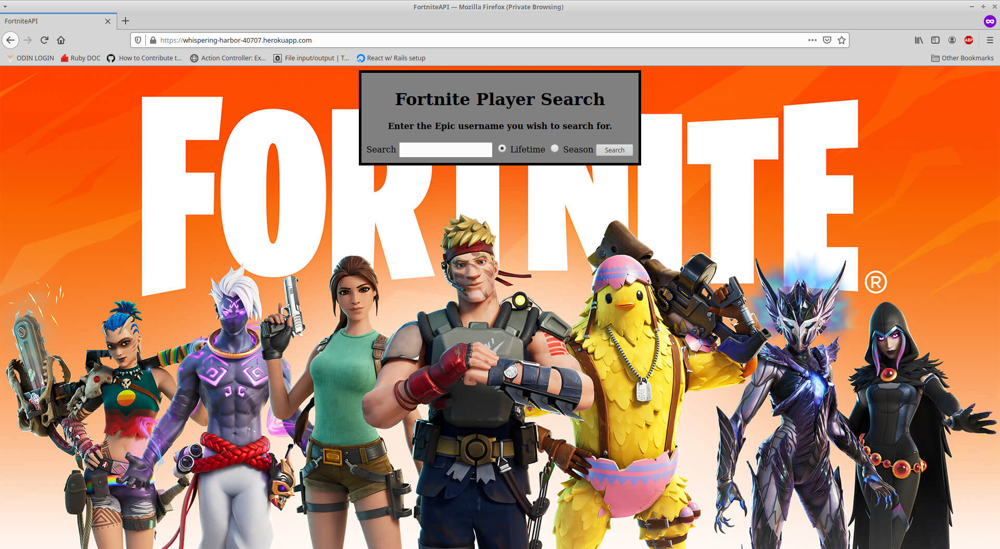
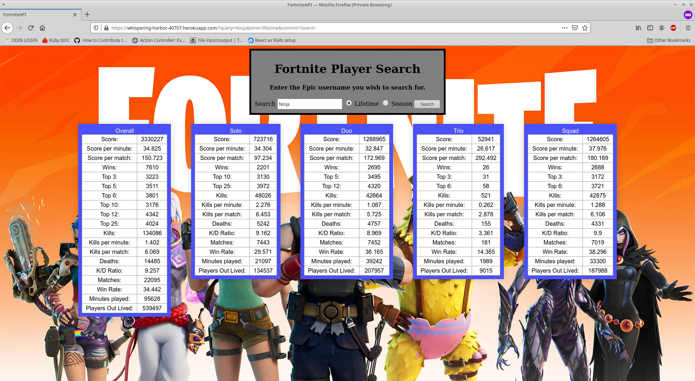
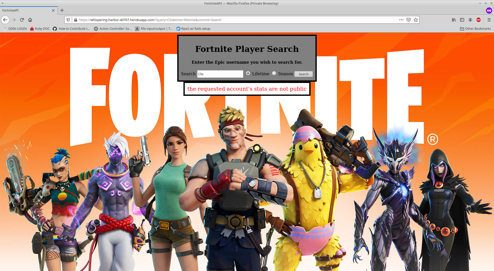

# Fortnite Stat Tracker

## Overview
This is a simple service designed to let players review their statistics in the popular online game, Fortnite. 
All stats are provided by https://fortnite-api.com/.

Using the program couldn't be any easier:
1.) Enter the name of the Epic ID that you wish to search for.
2.) Select the scope of your search, either the current season or all time.
3.) Press search. If there's a problem with your query, the relevant  message will be displayed on screen.

Users are able to opt out of stat sharing, therefore, some users stats may not be publically available or incomplete.

***
## Live Demo

You can try it out [here](https://whispering-harbor-40707.herokuapp.com/)  

The design is currently primarily built for desktop use.

Heroku is (in this case) a complimentary service and it may take up to sixty seconds to start a dyno on your initial launch. 
___Thank you for your patience.___


## Screenshots 






***
## Installation 

Clone the repo to your local machine: 
```ruby
$ git clone https://github.com/Kojack8/Fortnite_stats_API
```
Navigate to the directory containing that repo:
```ruby
$ cd Fortnite_stats_API/
```
Install the needed gems:
```ruby
$ bundle install
```
Install webpacker:
```
$ rails webpacker:install
```
Migrate the database:
```ruby
$ rails db:migrate
```
Finally, on root path run a local server:
```ruby
$ rails s
```
Open browser to view application:
```ruby
localhost:3000
```